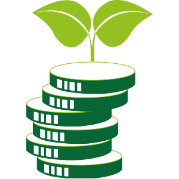

# 1️⃣ Introducción a la Sostenibilidad y su relación con la informática

{align="right"}

La palabra *sostenibilidad* aparece cada vez más en conversaciones, en los medios y en las empresas. Pero, ¿qué significa realmente?

Ser sostenible no consiste solo en reciclar una botella de plástico o apagar la luz al salir de casa. La sostenibilidad es una manera de pensar y de actuar: significa vivir, trabajar y producir de un modo que respete los recursos del planeta, para que las generaciones futuras también puedan disfrutarlos.

Podemos imaginarla como un taburete con tres patas. Si falta una, se tambalea:

- La pata medioambiental, que protege los bosques, los mares, la atmósfera y la biodiversidad.
- La pata económica, que busca un crecimiento duradero, sin explotar los recursos de forma irresponsable.
- La pata social, que garantiza la igualdad, el bienestar y la justicia para todas las personas.

!!!bug "Solo cuando las tres se mantienen en equilibrio podemos hablar de un desarrollo verdaderamente sostenible"

## Los Objetivos de Desarrollo Sostenible (ODS)

En 2015, la ONU presentó la Agenda 2030, una especie de mapa que marca el camino hacia un futuro mejor. Se traduce en 17 Objetivos de Desarrollo Sostenible (ODS).

**Estos objetivos no son simples palabras**: son compromisos que afectan a gobiernos, empresas y ciudadanos. Erradicar la pobreza, garantizar una educación de calidad, usar energías limpias, reducir la desigualdad o luchar contra el cambio climático son solo algunos de ellos.

En **informática** y **redes**, hay ciertos ODS que tienen una relación directa con lo que hacemos cada día:

- **ODS 7**: Energía asequible y no contaminante. Cada ordenador encendido consume electricidad; cada data center funciona como una “fábrica invisible de calor”.
- **ODS 9**: Industria, innovación e infraestructura. La tecnología debe ser motor de progreso, pero sin destruir el entorno.
- **ODS 12**: Producción y consumo responsables. Un portátil no debería acabar en la basura cuando aún puede repararse o reutilizarse.
- **ODS 13**: Acción por el clima. Lo que hoy parece un clic inocente en la nube suma millones de toneladas de CO₂ en todo el planeta.

## La informática y su huella en el planeta

En el sector de la informática, hablar de sostenibilidad es fundamental. Aunque a veces lo olvidemos, cada decisión tecnológica tiene un precio ambiental.

💡 **Pensemos en un ejemplo**
        
    Cuando enviamos un correo electrónico con un archivo adjunto, ese mensaje no “vuela mágicamente” hasta la bandeja del destinatario
    
    Pasa por servidores, routers, sistemas de almacenamiento y centros de datos que consumen electricidad las 24 horas del día. Ahora multipliquemos eso por los miles de millones de correos enviados a diario.
    
    El resultado es una huella digital tan real como el humo de una fábrica.

**Lo mismo ocurre con el hardware**.

    Para fabricar un smartphone, se necesitan minerales que se extraen de minas abiertas en países lejanos, a veces con graves consecuencias sociales y ambientales. Y, cuando ese móvil queda obsoleto, suele terminar olvidado en un cajón o, peor aún, como residuo electrónico que contamina suelos y aguas.

Sin embargo, la informática no es solo parte del problema, también puede ser parte de la solución. Con las herramientas adecuadas, podemos reducir el consumo energético, alargar la vida útil de los equipos y diseñar infraestructuras más respetuosas con el medio ambiente. La misma tecnología que genera impacto puede convertirse en aliada de la sostenibilidad.

📖 **Actividad de reflexión**

Imagina que todos los ordenadores de tu aula permanecen encendidos día y noche durante un mes, aunque nadie los use. ¿Qué consecuencias tendría? -- ¿cómo se podría evitar ese derroche sin renunciar al aprendizaje?

## La paradoja digital

{align="right"}

Vivimos en un mundo donde cada vez dependemos más de la tecnología. La digitalización parece la respuesta a muchos problemas: menos papel, más comunicación rápida, más servicios accesibles. Sin embargo, esa misma digitalización genera un impacto que muchas veces pasa desapercibido.

!!!tip "Ejemplo -- La Nube ☁️"
    Pensamos que subir fotos a Google Drive o guardar un trabajo en OneDrive es algo intangible. Pero, en realidad, todos esos datos se almacenan en enormes centros de datos que consumen tanta electricidad como una ciudad mediana.

🟥 **La paradoja es clara**
    
    la tecnología puede salvar al planeta, pero también puede hundirlo si no se gestiona bien. Por eso, es vital que los futuros profesionales de la informática aprendáis a mirar siempre la otra cara de la moneda.

## El papel del técnico en informática sostenible

Puede parecer que un técnico de sistemas o de redes tiene poca influencia en el futuro del planeta. Sin embargo, en la práctica, vuestro trabajo diario marcará la diferencia:

- Elegir instalar un servidor virtualizado en lugar de cinco físicos.
- Configurar ordenadores con planes de ahorro energético.
- Alargar la vida de equipos a través del mantenimiento preventivo.
- Promover el reacondicionamiento de dispositivos en lugar de desecharlos.
- Asesorar a una empresa sobre cómo gestionar adecuadamente sus residuos electrónicos.

👉 Cada una de estas pequeñas decisiones, multiplicada por cientos de técnicos y empresas, puede transformar la forma en la que la informática se relaciona con el medio ambiente.

## Conclusión

La sostenibilidad no es un concepto lejano, ni exclusivo de políticos o ecologistas. Es una responsabilidad compartida que atraviesa todos los sectores, incluida la informática.

A lo largo de esta asignatura veremos cómo las tecnologías que usáis cada día no son neutrales: tienen un coste ambiental, social y económico. Entender ese coste y aprender a reducirlo es el primer paso hacia una informática verdaderamente responsable.

En resumen:

- La sostenibilidad es equilibrio entre medioambiente, economía y sociedad.
- La Agenda 2030 y los ODS nos marcan un camino.
- La informática es parte del problema, pero también parte de la solución.

Vosotros, como futuros profesionales, tenéis un papel esencial en la transición hacia un modelo más verde y justo.

!!!note "Debate"
    ¿Creéis que un técnico de informática puede ayudar más al planeta que un activista ecologista? ¿Por qué sí o por qué no?